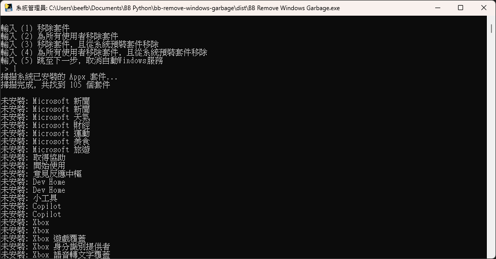

# BB 移除Windows垃圾

快速移除Windows全新安裝時自帶的垃圾軟體及取消自動Windows服務  
常見垃圾一一挑出, 逐項選擇是否移除  

非系統管理員權限, 僅可為目前使用者移除套件  
以系統管理員權限執行以解鎖以下功能:  

- 可選為所有使用者移除套件
- 可選從系統預裝套件移除
- 可選取消自動Windows服務

### 截圖



# 下載

### 到 Releases 下載最新版

- [BB Remove Windows Garbage.exe](https://github.com/BeefBB/bb-remove-windows-garbage/releases)

### 備註

Windows版本多樣, 移除失敗為正常現象  
移除軟體或停用自動服務可能影響部分Windows功能或體驗, 請確保知道自己在做什麼  

# 想自己編譯?

```bash
py -m venv .venv
.\.venv\Scripts\Activate.ps1
pip install -r requirements.txt
```
```bash
pyinstaller --noconfirm --onefile --name="BB Remove Windows Garbage" bb-remove-windows-garbage.py
```

打包後會在 `.\dist`  

# 版權

MIT License  